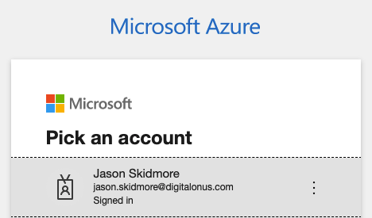

## Terraform quick start with azure provider

Login to Azure account.

`az login`




1. To view the current Azure subscription, use [az account show]()https://docs.microsoft.com/en-us/cli/azure/account#az-account-show.

    `az account show`

2. If you have access to multiple available Azure subscriptions, use [az account list](https://docs.microsoft.com/en-us/cli/azure/account#az-account-list) to display a list of subscription name ID values:

    `az account list --query "[].{name:name, subscriptionId:id}"`

    **Example Output**
```
  ✗ az account list --query "[].{name:name, subscriptionId:id}"
  [
  {
    "name": "Azure subscription 1",
    "subscriptionId": "461f9a5b-56ca-407e-844d- 5cb08ec21b46"
  },
 {
    "name": "Pay-As-You-Go",
    "subscriptionId": "c4774376-bc4c-48e6-93eb-c0ac26c6345d"
 }
]
```

3. Should you have more than one Subscription, you can specify the Subscription to use via the following command:

`az account set --subscription="SUBSCRIPTION_ID"`


Notes:

Calling `az account set` doesn't display the results of switching to the specified Azure subscription. However, you can use `az account show` to confirm that the current Azure subscription has changed.

4. We can now create the **Service Principal** which will have permissions to manage resources in the specified Subscription using the following command:

`az ad sp create-for-rbac --role="Contributor" --scopes="/subscriptions/SUBSCRIPTION_ID"`

This command will output 5 values:

```
{
  "appId": "00000000-0000-0000-0000-000000000000",
  "displayName": "azure-cli-2017-06-05-10-41-15",
  "name": "http://azure-cli-2017-06-05-10-41-15",
  "password": "0000-0000-0000-0000-000000000000",
  "tenant": "00000000-0000-0000-0000-000000000000"
}
```

These values map to the Terraform variables like so:

* **appId** is the `client_id`
* **password** is the `client_secret`
* **tenant** is the `tenant_id`


For Terraform Azure provider:
Set ENV vars from the above

**Example**
```bash
$ export ARM_CLIENT_ID="00000000-0000-0000-0000-000000000000"
$ export ARM_CLIENT_SECRET="00000000-0000-0000-0000-000000000000"
$ export ARM_SUBSCRIPTION_ID="00000000-0000-0000-0000-000000000000"
$ export ARM_TENANT_ID="00000000-0000-0000-0000-000000000000"
```

Or

Use variables for the Terraform Azure provider

```
provider "azurerm" {
  # Whilst version is optional, we /strongly recommend/ using it to pin the version of the Provider being used
  version = "=2.4.0"

  subscription_id = "00000000-0000-0000-0000-000000000000"
  client_id       = "00000000-0000-0000-0000-000000000000"
  client_secret   = var.client_secret
  tenant_id       = "00000000-0000-0000-0000-000000000000"

  features {}
}
```

5. You can test if these values work:

`az login --service-principal -u CLIENT_ID -p CLIENT_SECRET --tenant TENANT_ID`
